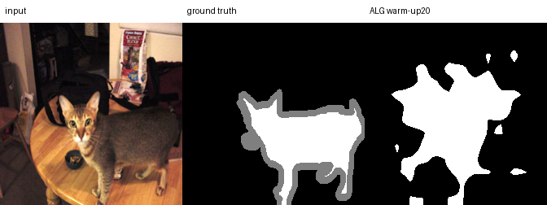
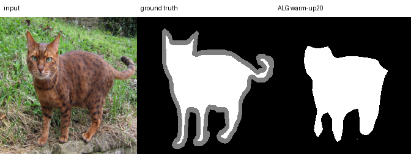
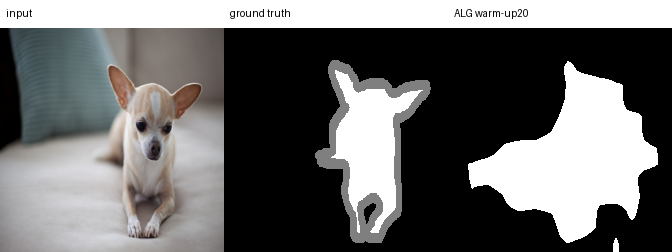
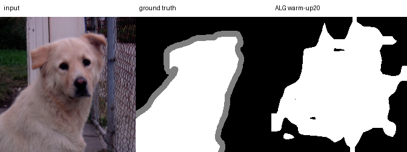
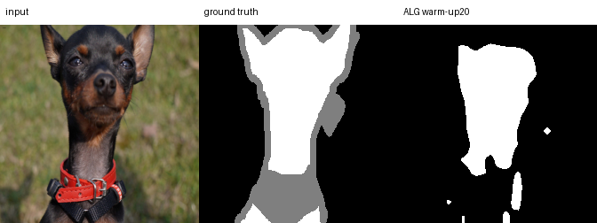
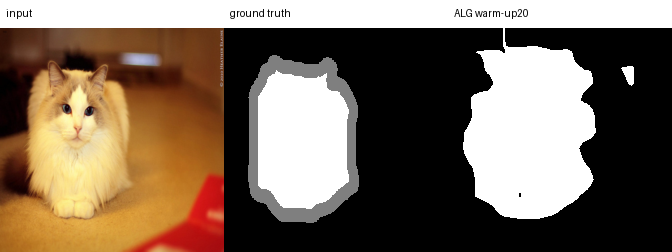
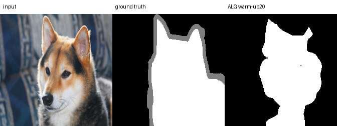
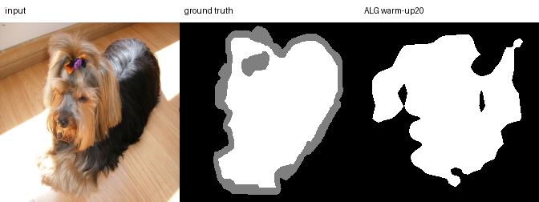

# Phase 1 Pet batch 128 ALG warm-up 20 정성 결과

정성 표본 8개와 encoder seed 1, probe seed 1은 결과 확인 전에 고정됐습니다. 각
panel의 열 순서는 다음과 같습니다.

```text
Input | Ground truth | ALG warm-up 20
```

회색 ground-truth 경계는 ignore pixel이며 metric 계산에서 제외됩니다. Panel은
official test metric을 계산한 동일 forward pass의 예측을 재사용했습니다. 8개 panel과
원본 예측 mask 8개의 크기·mode·decode를 확인했고 Git에는 panel만 추적합니다.

















육안 확인에서 손상된 파일, 빈 panel, 열 순서 오류나 전면 단색 출력 같은 명백한
파이프라인 실패는 없었습니다. 일부 사례는 배경까지 넓게 활성화되므로 이 8장만으로
우열을 정하지 않고, 전체 test 3,669장의 global metric을 결론 기준으로 사용합니다.

정확한 파일 hash와 크기는 [figures/manifest.json](figures/manifest.json)에 있습니다.
