# Phase 1 Pet batch 64 frozen probe 정성 결과

정성 표본 8개, encoder seed 1, probe seed 1은 결과 확인 전에 고정됐습니다. 같은
8개에 iBKD λ=0.25와 0.5를 모두 표시해 λ를 사후 선택하지 않았습니다. 각 panel의
열 순서는 다음과 같습니다.

```text
Input | Ground truth | Vanilla | KD | LG | ALG | iBKD
```

회색 ground-truth 경계는 ignore pixel이며 foreground/background IoU 계산에서
제외됩니다. Panel은 official test metric을 계산한 같은 forward pass의 예측을
재사용했습니다. 16개 panel과 그 원본 mask 80개의 크기·mode·decode를 감사했고,
Git에는 비교용 panel만 추적합니다.

## iBKD λ=0.25 panel

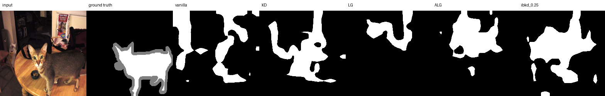

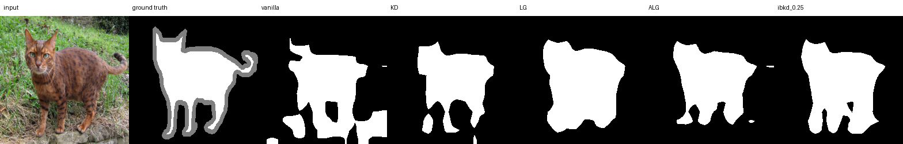

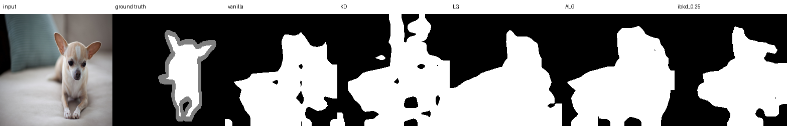

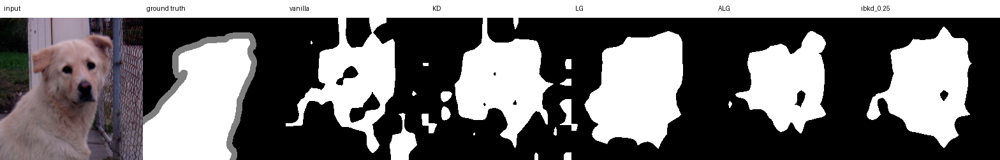

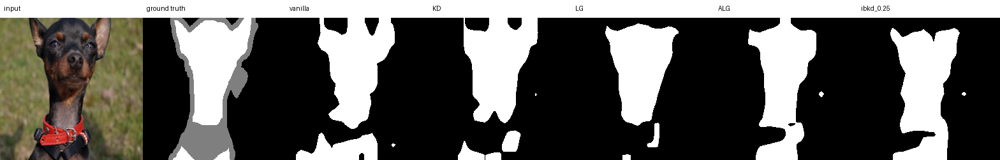

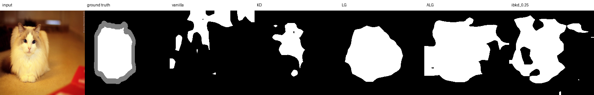

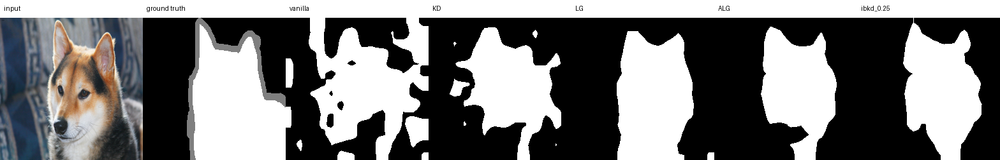

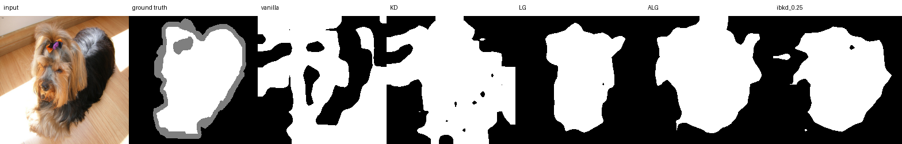

## iBKD λ=0.5 panel

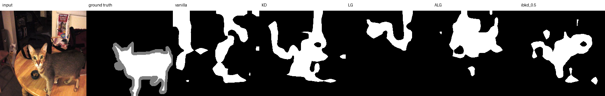

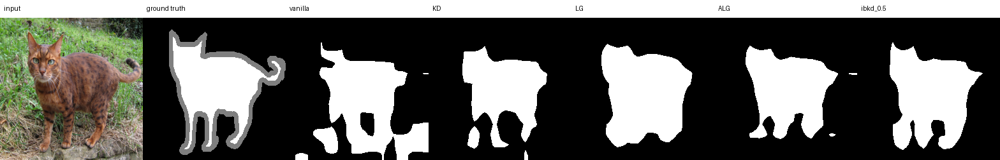

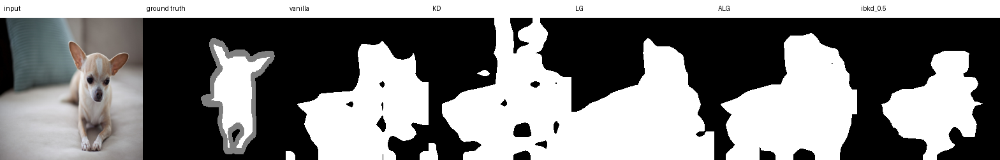

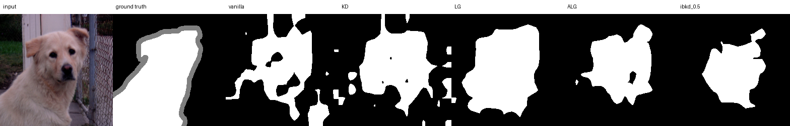

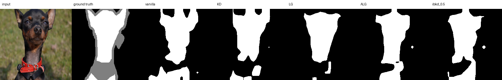

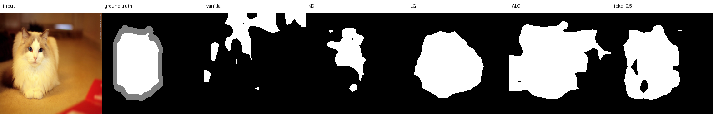

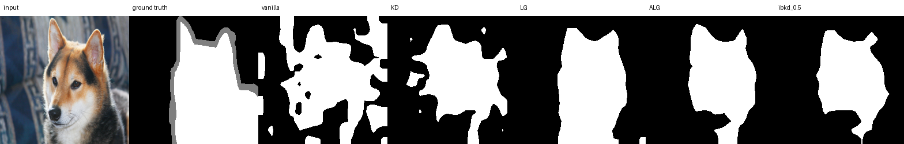


## 해석 범위

육안 결과에 파일 손상, 열 순서 오류 또는 전면 단색 mask 같은 파이프라인 실패는
보이지 않았습니다. 대표 panel에서도 LG/ALG가 대체로 동물 윤곽을 깨끗하게
복원하며, 정량 순위와 모순되는 체계적 iBKD 우위는 확인되지 않습니다. 다만 이
8개는 사례 설명용이며, 방법 순위와 결론은 3,669개 test 전체의 global metric과
paired encoder-seed 비교를 기준으로 합니다.

정확한 파일 hash와 크기는 [figures/manifest.json](figures/manifest.json)에 있습니다.
