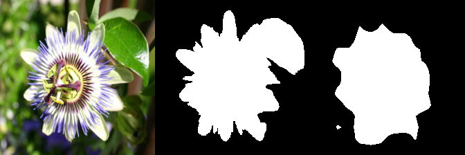
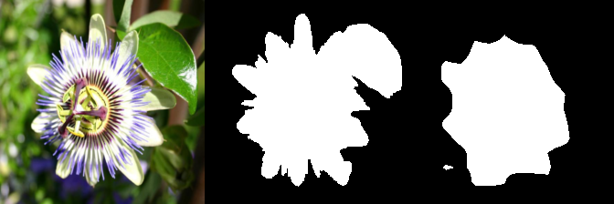
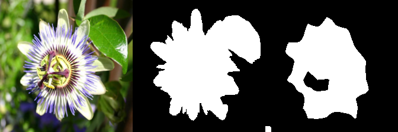
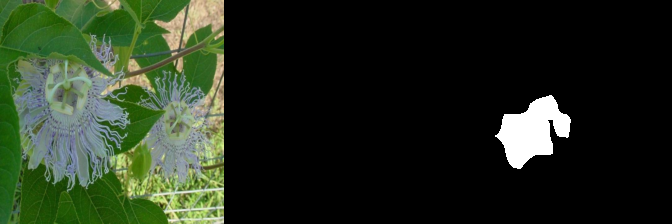
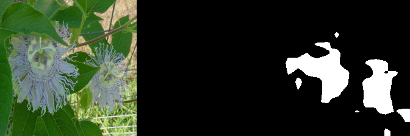
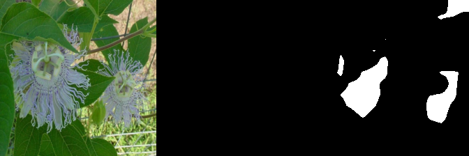
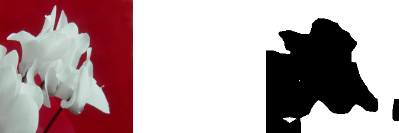
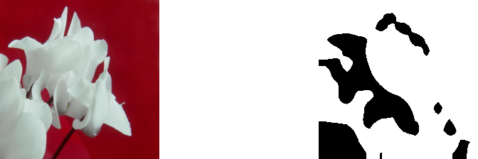
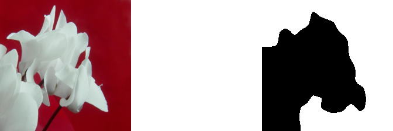

# Phase 0.5 Flowers 정성 결과

이 문서는 전체 실행에서 실제 사용한 Flowers-102 test 이미지와 segmentation
probe 출력을 Git에서 바로 확인하기 위한 기록입니다.

각 PNG는 왼쪽부터 다음 세 칸으로 구성됩니다.

```text
실제 입력 사진 | 자동 생성 pseudo-mask | frozen-feature probe 예측
```

검정은 배경(class 0), 흰색은 전경(class 1)입니다. 입력과 mask는 `224 x 224`, 전체
panel은 `672 x 224`입니다. 모든 그림은 결과를 보기 전에 고정한 test ID
`1, 45, 568, 1737, 3650, 5775, 8189`와 probe seed 1에서 생성했습니다.

## 무엇을 비교했는가

| 방법 | 비교 역할 | 사용한 encoder | 정성 panel용 선택 |
|---|---|---|---|
| Ours | 조건 일치 주 진단군 | researcher-sync seed 1, λ 0.5 | LR 0.01, epoch 20 |
| ALG | 조건 일치 주 진단군 | researcher-sync seed 1 | LR 0.1, epoch 91 |
| KD | 조건 불일치 탐색군 | generic-KD seed 42 | LR 0.01, epoch 60 |

각 encoder는 고정했으며 세 방법 모두 동일한
`Conv2d(192, 2, 1, bias=True)` probe만 따로 학습했습니다. Ours λ `0.25`는
포함되지 않습니다. checkpoint와 PNG hash는
[`figures/flowers102/manifest.json`](figures/flowers102/manifest.json)에 있습니다.

## 대표 사례

### ID 1 — 일반적인 pseudo-mask 사례

Ours



ALG



KD — 조건 불일치 탐색용



### ID 45 — pseudo-mask가 완전 배경인 실패 사례

Ours



ALG



KD — 조건 불일치 탐색용



### ID 568 — pseudo-mask가 거의 완전 전경인 실패 사례

Ours



ALG



KD — 조건 불일치 탐색용



## 전체 고정 표본

| test ID | Ours | ALG | KD (탐색용) |
|---:|---|---|---|
| 1 | [PNG](figures/flowers102/ours/image_00001.png) | [PNG](figures/flowers102/alg/image_00001.png) | [PNG](figures/flowers102/kd/image_00001.png) |
| 45 | [PNG](figures/flowers102/ours/image_00045.png) | [PNG](figures/flowers102/alg/image_00045.png) | [PNG](figures/flowers102/kd/image_00045.png) |
| 568 | [PNG](figures/flowers102/ours/image_00568.png) | [PNG](figures/flowers102/alg/image_00568.png) | [PNG](figures/flowers102/kd/image_00568.png) |
| 1737 | [PNG](figures/flowers102/ours/image_01737.png) | [PNG](figures/flowers102/alg/image_01737.png) | [PNG](figures/flowers102/kd/image_01737.png) |
| 3650 | [PNG](figures/flowers102/ours/image_03650.png) | [PNG](figures/flowers102/alg/image_03650.png) | [PNG](figures/flowers102/kd/image_03650.png) |
| 5775 | [PNG](figures/flowers102/ours/image_05775.png) | [PNG](figures/flowers102/alg/image_05775.png) | [PNG](figures/flowers102/kd/image_05775.png) |
| 8189 | [PNG](figures/flowers102/ours/image_08189.png) | [PNG](figures/flowers102/alg/image_08189.png) | [PNG](figures/flowers102/kd/image_08189.png) |

## 해석 제한

가운데 mask는 사람이 만든 pixel ground truth가 아니라 blue-screen 합성쌍에서 자동
복원한 pseudo-mask입니다. ID 45와 568처럼 명백한 실패가 있으므로 이 그림과
정량값은 파이프라인 진단에만 사용합니다. 실제 segmentation 확장성은 공식
trimap을 쓰는 Phase 1에서 판단합니다.
