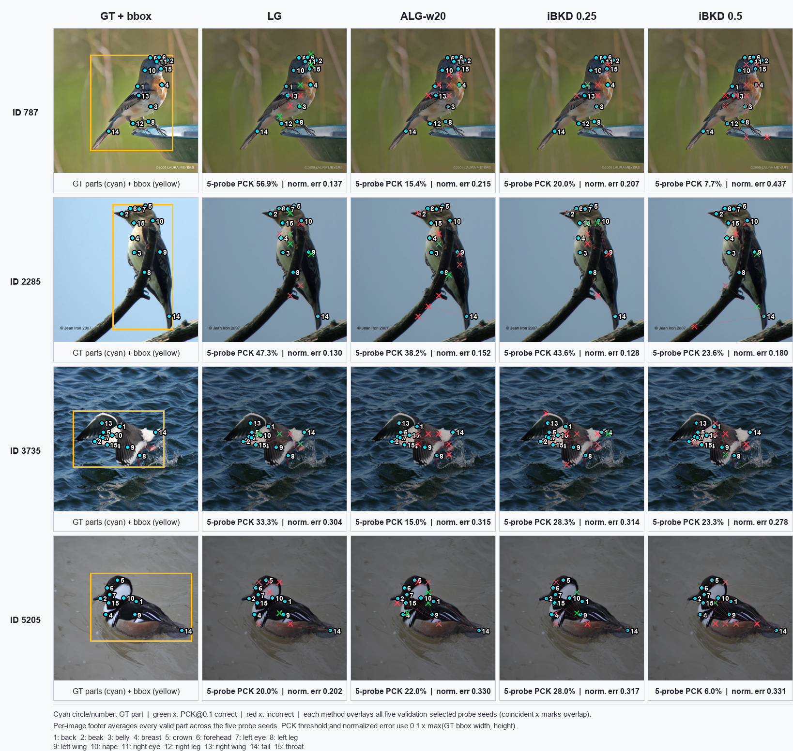
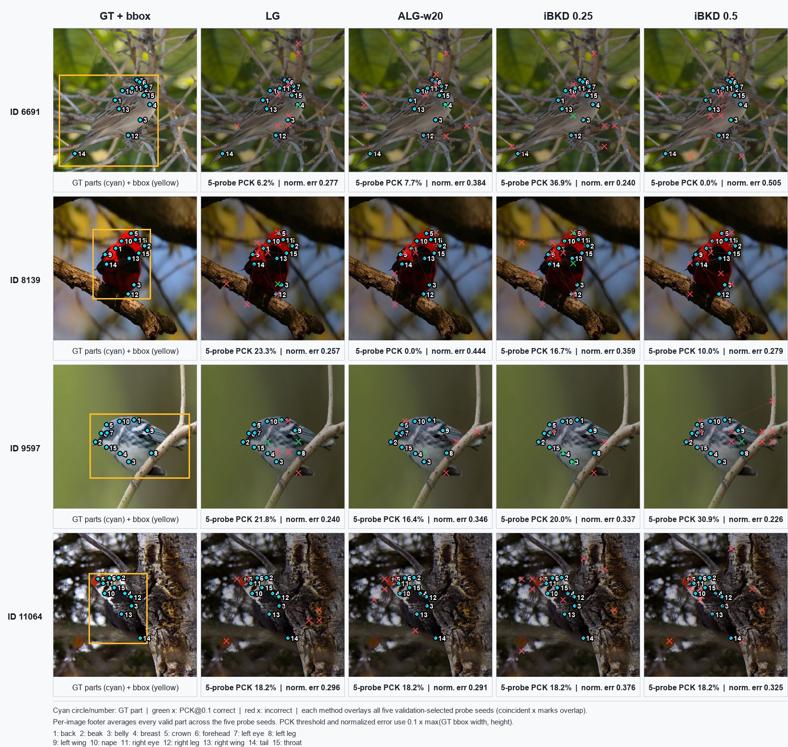
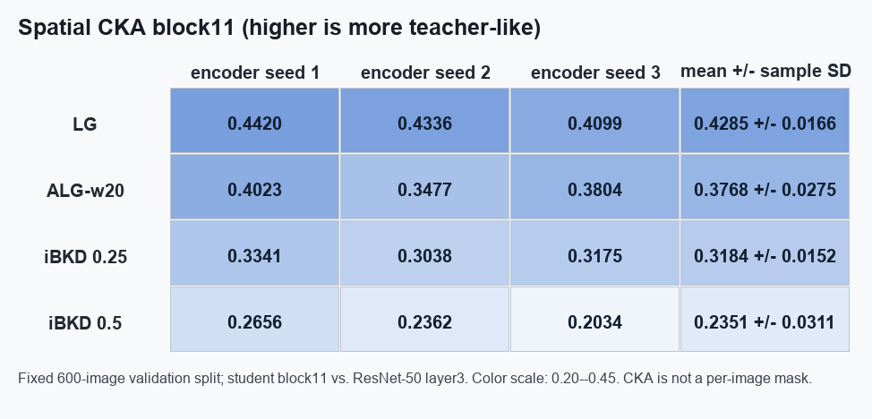
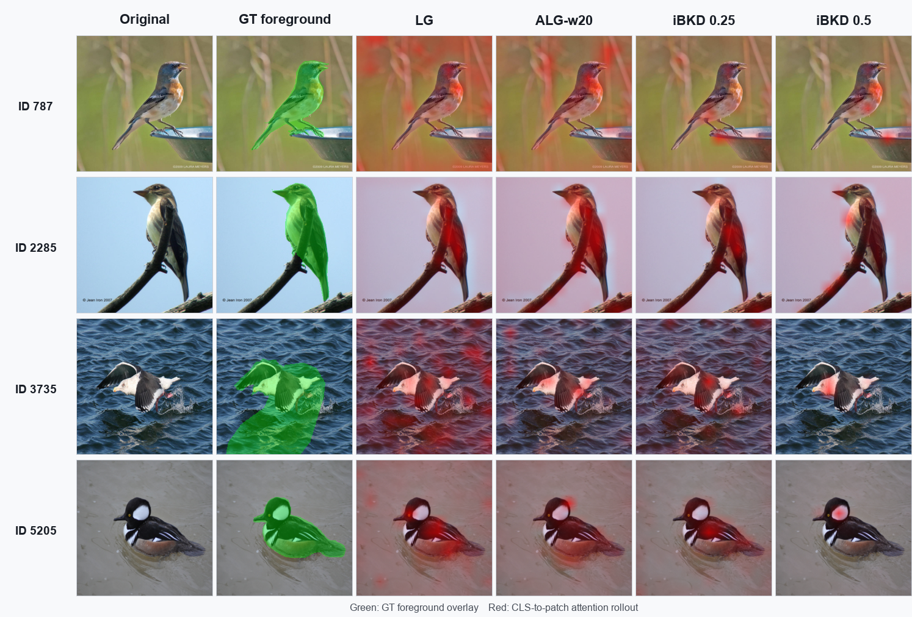
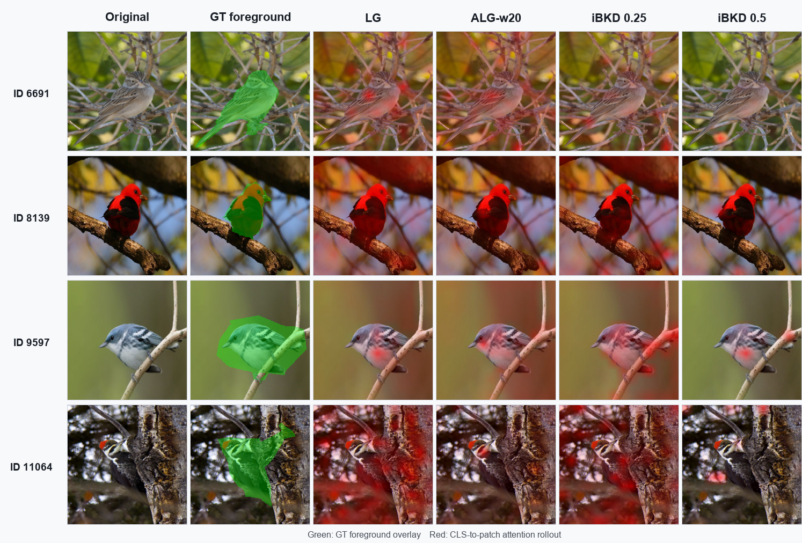

# CUB ResNet-50/224 batch128 직접 공간정보 진단 v2 — 3 seeds

상태: **H200 issue 737·739 완료 · encoder seed 1·2·3 결합 · 독립 감사 통과**

각 part-probe 셀에서 probe seed 5개를 먼저 평균한 뒤, 아래 `±`는 독립
classification encoder seed `[1,2,3]`에 대한 sample SD로 계산했습니다. Part
PCK@0.1이 주 직접지표이고 CKA와 attention–GT는 보조지표입니다.

| 방법 | Part PCK@0.1 ↑ | 정규화 위치오차 ↓ | CKA block11 ↑ | Attention AP ↑ | Pointing ↑ | FG mass ↑ |
|---|---:|---:|---:|---:|---:|---:|
| LG | 27.510 ± 2.030% | 0.2356 ± 0.0094 | 0.4285 ± 0.0166 | 0.2269 ± 0.0678 | 0.4428 ± 0.1313 | 0.1895 ± 0.0382 |
| ALG-w20 | 21.621 ± 2.716% | 0.2725 ± 0.0194 | 0.3768 ± 0.0275 | 0.2457 ± 0.0173 | 0.4819 ± 0.0361 | 0.1898 ± 0.0093 |
| iBKD λ=0.25 | 20.109 ± 2.024% | 0.2946 ± 0.0179 | 0.3184 ± 0.0152 | 0.2816 ± 0.0546 | 0.5195 ± 0.0356 | 0.2093 ± 0.0083 |
| iBKD λ=0.5 | 15.426 ± 1.858% | 0.3407 ± 0.0344 | 0.2351 ± 0.0311 | 0.2408 ± 0.0245 | 0.4956 ± 0.0165 | 0.2059 ± 0.0131 |

## 지표별 전체 시각 확인

### 1. Part PCK@0.1 · 정규화 위치오차

Issue 737에서 결과 확인 전에 고정한 official-test image ID 8개를 모두 사용했습니다.
왼쪽 열은 원본 사진의 **GT 15개 part(청록 원)**와 **정규화 기준 bbox(노란색)**이고,
나머지 열은 같은 seed-1 encoder에 validation으로 선택한 probe seed 5개의 예측을 모두
겹쳐 표시한 것입니다. **초록 ×는 PCK@0.1 정답, 빨강 ×는 오답**입니다. 각 사진 아래의
`5-probe PCK`와 `norm. err`는 보이는 모든 part × probe seed 5개를 모아 계산했습니다.
같은 위치의 ×는 서로 겹칠 수 있습니다.

이 두 그림은 표의 **Part PCK@0.1**과 **정규화 위치오차**가 실제 사진에서 무엇을
측정하는지 보여줍니다. 최종 수치 자체는 8장 예시가 아니라 official test 전체와
encoder seed 3개를 사용한 위 표를 기준으로 합니다.

### 2. Spatial CKA block11

CKA는 한 사진의 영역을 칠하는 지표가 아니라, 고정 validation 600장에서 student
block11의 공간 feature와 ResNet-50 layer3 공간 feature가 얼마나 닮았는지를 측정한
집계값입니다. 따라서 사진 overlay 대신 encoder seed별 값을 그대로 heatmap으로
표시했습니다.

### 3. Attention AP · Pointing · FG mass

같은 고정 8장과 같은 seed-1 encoder를 사용했습니다. 왼쪽부터 원본, 초록색 GT
foreground, LG·ALG-w20·iBKD 두 설정의 CLS-to-patch attention rollout입니다.
붉은색이 강할수록 해당 위치에 attention이 더 많이 모인 것입니다.

이 그림은 표의 **Attention AP·Pointing·FG mass**를 직관적으로 확인하는 보조
자료입니다. 사진 예시는 seed 1이고 최종 순위 판단은 위 3-seed 정량 평균을
기준으로 합니다.

| 표의 지표 | 확인할 그림 |
|---|---|
| Part PCK@0.1 | part 그림의 초록/빨강 ×와 `5-probe PCK` |
| 정규화 위치오차 | part 그림의 GT–예측 거리와 `norm. err` |
| CKA block11 | encoder seed 1·2·3 CKA heatmap |
| Attention AP | attention rollout과 전체 GT patch의 정렬 정도 |
| Pointing | attention 최고점이 GT foreground 안에 있는지 |
| FG mass | 전체 attention 중 GT foreground 내부에 들어간 비율 |

part·CKA 생성 규칙, 사진별 집계값, checkpoint hash, 출력 hash는
[전체 시각화 manifest](qualitative_comparisons/complete_visualization_manifest.json)에,
attention 입력·출력 hash는
[attention manifest](qualitative_comparisons/manifest.json)에 고정했습니다.

## 감사

- issue 739 실행시간: 42.02분
- issue 739의 checkpoint·전체 이력·원시 로그는 Git history가 아닌 검증된 [Release 자산](artifact_release.json)에 보존
- issue 739 encoder 8개는 감사된 issue 730 classification checkpoint의 파일·state hash와 일치
- 새 part-probe checkpoint 40개 모두 SHA-256, `weights_only=True`, strict load, 유한값 검사 통과
- issue 737의 seed-1 part-probe 20개 감사 결과를 합쳐 encoder seed 3개 × probe seed 5개 구성
- seed 2·3의 validation 후보 120개와 선택 40개를 끝낸 뒤 official test를 열었으며 test는 선택에 사용하지 않음
- 세 seed 전체 official-test 평가는 part probe 60회 + attention 12회 = 72회
- CKA는 validation 600장만 사용했고 official test를 사용하지 않음
- train의 공식 visible keypoint 64,697개 중 image 5007의 프레임 밖 1개만 사전 규칙대로 제외; validation 7,164개와 test 69,546개는 모두 유효
- issue 737의 32개와 issue 739의 64개, 총 96개 attention 정성 이미지를 두 보고서에 보존

## 해석

- **주 지표 Part PCK는 LG가 가장 높습니다.** LG는 27.510%, ALG-w20은 21.621%, iBKD λ=0.25는 20.109%, iBKD λ=0.5는 15.426%입니다.
- CKA block11도 LG가 0.4285로 가장 높고, 세 encoder seed 모두 `LG > ALG-w20 > iBKD-0.25 > iBKD-0.5` 순서입니다.
- Attention의 3-seed 평균은 AP·pointing·foreground mass 모두 iBKD λ=0.25가 가장 높습니다. 다만 seed별 1위가 달라지고, 주 Part PCK 및 CKA와 방향이 일치하지 않으므로 보조적인 국소화 신호로만 해석합니다.
- Frozen segmentation probe에서도 LG가 가장 높았던 결과와 함께 보면, 현재 CUB 프로토콜은 **iBKD가 LG/ALG보다 공간정보를 전반적으로 더 잘 보존한다는 가설을 지지하지 않습니다.**
- 이 결론은 잠긴 ResNet-50/224 scratch·현재 image-loader 조건의 guided 네 방법에 한정합니다. 이후 loader를 바꾸면 기존 결과는 그대로 보존하고 새 버전에서 모든 비교 방법을 동일 조건으로 다시 실행해야 합니다.
